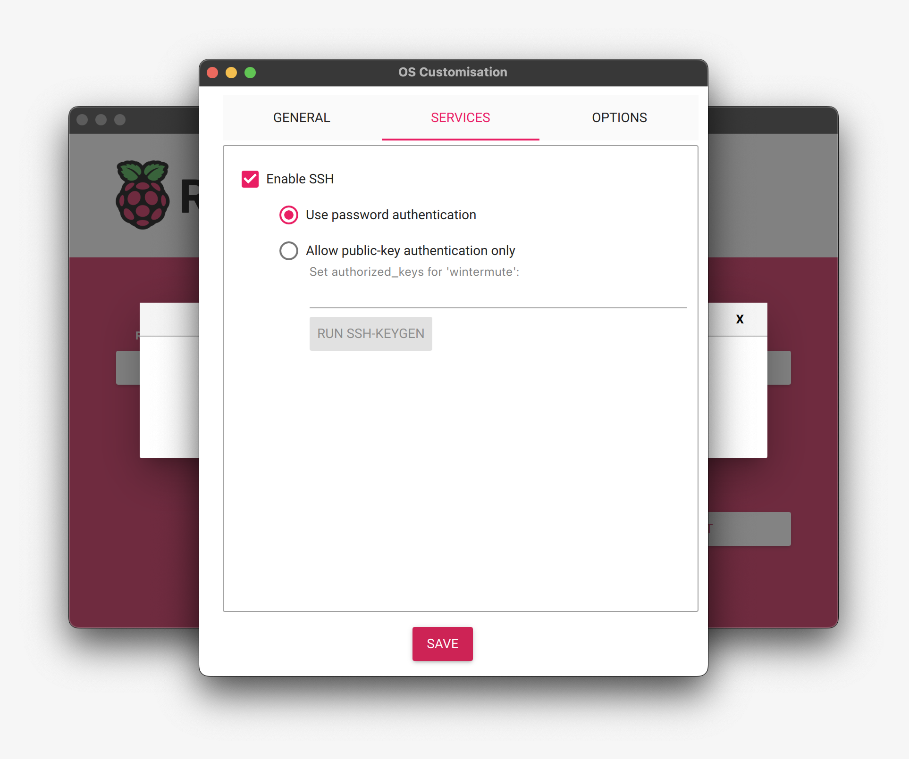

# Using Machine Learning and Cameras on the Edge for Conservation and Sustainability

### This tutorial is a step step instruction manual on how to:

1. Set up a network to connect your computer to a Raspberry pi,
2. Connecting a Camera to your Raspberry Pi
3. Connect a Raspberry Pi (a single board computer) to a BrainCraft Hat (a microprocessor that adds a screen, audio, and microphone to your raspberry Pi) and a fan (for cooling it down when it’s overthinking)
4. Configuring Raspberry Pi to do Machine Learning
5. Adding a simple AI model using teachable machine to your raspberry PI for you to use in your conservation technology projects.

### Important Notes:

- Most of this tutorial has been copied from a sources around the internet and aggregated into a cohesive guide. We've done our best to link to these sources, but if you notice we've missed something, please help us fix that
- This tutorial is written for Linux based operating systems (macOS specifically). This process should mostly work with Windows OS, but there will be some extra googling to get everything set up. Feel free to submit a Windows based version or edits that would make it operating system agnostic if you feel so inclined.
- Whenever you see text within triangle brackets, this is placeholder text. Make sure to replace the placeholder text and brackets with the right information. For instance `<Favorite_Animal>` would be `tiger`
- In the bash commands we share with you, the `$` signifies the beginning of a line. You do not need to paste this part of the command into your terminal.

## 1. Materials Needed

1x needed per team:

- [Raspberry Pi 4 B ](https://www.adafruit.com/product/4296) (minimum 4gb RAM)
- [Raspberry Pi Camera Board](https://www.adafruit.com/product/3099)
- [Camera extension cable](https://www.adafruit.com/product/1731)
- [BrainCraft Hat](https://www.adafruit.com/product/4374)
- [2 x 20 Socket Riser Header](https://www.amazon.com/dp/B07PPD25MK?psc=1&ref=ppx_yo2ov_dt_b_product_details)
- [Power supply compatible with Raspberry Pi 4](https://www.adafruit.com/product/4298)
- [microSD card with adapter 16 GB](https://www.adafruit.com/product/2693)
- [Micro SD Card Reader](https://www.adafruit.com/product/939) (optional)
- [USB C to USB A Adapter](https://www.adafruit.com/product/5030) (optional)
- [Raspberry Pi Case](https://www.adafruit.com/product/4301)
- [Camera Case](https://www.adafruit.com/product/3253)
- [Tripod](https://www.amazon.com/dp/B08C53F6CD) (optional)

## 2. Setting up a Network Between your Computer and a Raspberry PI

_Goal: In this section we are installing an operating system on our Raspberry Pi, connecting to our internet network, and making sure that our laptop can easily communicate with the Raspberry Pi._

**Required Equipment:**

- Computer
- MicroSD card 16GB
- Adaptor for microSD to your computer (usb-C port)
- [Raspberry Pi 4](https://www.adafruit.com/product/4296)

### 2.1 Installing an Operating System on your Raspberry PI

- Take your SD card out of the package, or use one that you have close by but make sure that it’s empty because we’re going to completely overwrite it. Connect your SD card to your computer using your microSD adapter for USB-C (if you’re using a newer Mac).
- Visit [this link](https://www.raspberrypi.org/software/) and click on the “Download for MacOs” button and go through the steps to install on your computer. If the install is successful you should be able to see this:
  
- Choose Raspberry Pi 4
- Choose the recommended operating system.
- To make sure that you are mounting the image of this operating system on the SD Card(not your computer), plug and unplug the SD card so that you can see it appear and disappear on the storage section of the Raspberry Pi Imager. That way you’ll make sure that you are installing the operating system in the correct place.
- Click Next and then click edit settings
  

- Choose the options as detailed in the screenshot below. Note, you should choose your own username of the Pi, WiFi settings, and password. **Make sure you record your username and password down!**

  

- Then, make sure SSH is enabled like below. Secure SHell (SSH) protocol allows us to access the terminal of a Raspberry Pi remotely from our computer on the same network.

  

- Click “SAVE” - this will install the latest operating system on your SD card.

### 2.2 Connecting to your Raspberry Pi (and your Raspberry Pi to the Internet)

_NOTE: In a classroom with many students we must turn the Pis one by one and see their different IP addresses._

**Required Downloads:**

- [Visit the nmap install page here](https://nmap.org/download.html)

0. Install nmap on your computer. nmap is a network sniffing tool for understanding network traffic. The goal is to identify the IP address of our raspberry PI.

1. First identify your own IP address. You can do this by holding on the “option” button on your Mac keyboard while clicking on the “wifi” button on your top menu. Write down the IP address that your computer is using. The first time you run nmap from your terminal make sure you do it without turning on your PI.

```bash
nmap -sP <YOUR_IP_ADDRESS>/24
nmap -sP 192.168.1.79/24
```

2. Now that you’ve seen the IP addresses that are in your network, turn on your PI and see if there is \_a new IP address. \_The new IP address will be the IP address that your PI is using. Note, if you don’t see a new IP address you might have to plug the SD card back on your computer and make sure that you’ve done all the steps in the previous section correctly. Once you identify it you’re going to want to ssh into it from your Mac’s terminal:

```bash
ssh <PI USERNAME>@<YOUR IP NETWORK>
# for example
ssh pi-name@192.168.1.90
```

3. Skip this step if you ssh'd into your Pi. If you don’t find your raspberry address here, or if it doesn’t work do:

```bash
ssh username@hostname.local
```

4. Say "yes" and connect to the pi using the password you set earlier. If you are able to ssh then you’re connected to the internet!

5. Copy and paste the IP address.
6. Say “yes” and connect to the pi using the password you set earlier. If you are able to ssh then you’re connected to the internet!
7. Write down your PI’s **IP address** somewhere safe, we’re going to use them later on in the tutorial.

### 2.3 Update/Upgrade
1. Now that you are logged in, perform an update/update:
```bash
sudo apt update
sudo apt -y upgrade
```
and
```bash
sudo apt install --upgrade python3-setuptools
```

### 2.4 Setup Virtual Environment
Starting with the October 10, 2023 Bookworm release of the Raspberry Pi OS, the use of Python Virtual Environments (venv) when pip installing packages is required. A Python Virtual Environment is an isolated space where you can work on your project, separately from your system-installed Python packages. You can read more on Python Virtual Environments [here](https://learn.adafruit.com/python-virtual-environment-usage-on-raspberry-pi).

1. To Install and activate the virtual environment, use the following commands:
```bash
sudo apt install python3.11-venv
python -m venv env --system-site-packages
```
2. Activate the virtual environment:
```bash
source env/bin/activate
```
OK you've now got a nice, clean, connected, and up-to-date Pi!

### 2.5 Seeing and Controlling your Raspberry Pi’s Desktop through your Laptop (Optional)

Sometimes it is not convenient to physically work with a device. Virtual Network Computing (VNC) allows you to control the desktop of one device from another. VNC relies upon a client and a server. The client runs on a device you can physically interact with, such as a personal laptop, desktop, tablet, or phone. The server runs on your Raspberry Pi. When you use VNC, the client transmits keyboard and mouse events to the server. The server executes those events on your Raspberry Pi, and returns screen updates to the client.

The VNC client displays the desktop of your Raspberry Pi in a window. You can interact with the desktop as though you were working on the Raspberry Pi itself.

First, you have to enable the VNC server by opening raspi-config with the following line.

```bash
sudo raspi-config
```

A pop-up will appear → navigate to “Interface Options” → select “VNC” and press Enter → under **Would you like the VNC Server to be enabled?** select “Yes” and press Enter → navigate down and select “Finish”.

Now we enabled VNC on our Raspberry Pi, you can connect to the VNC server by [following these instructions](https://www.raspberrypi.com/documentation/computers/remote-access.html#connect-to-a-vnc-server).

## 3. Braincraft HAT and Camera Hardware Install

Before plugging in or unplugging anything always ensure your Raspberry Pi is off and disconnected from power.

### Connect the Fan

Carefully position your Braincraft HAT screen side down. Take your fan from its packaging and connect the wires into the small connector that says FAN: P4. The Red wire should face the large black plastic connector. Once this is connected, take off the orange hole protector stickers from the board and position your fan on the middle of the board aligning the holes. Position the wire so it is not pinched under the fan, and carefully attach the screws firmly, but not too tight. You should be using the screws that _do not_ come with the small nuts (don’t use the nuts).


### Connect the Camera:


1. Ensure Pi is turned off
2. Locate the Camera Module port
3. Gently pull up on the edges of the port’s plastic clip
4. Insert the Camera Module ribbon cable through the Braincraft HAT camera cable slit and then into the port; make sure the blue side of the cable is facing the ethernet ports.
5. Push the black plastic clip back into place firmly, but make sure you’re pressing it down vertically. This part is tricky so be careful!
6. Place the Camera board into the protective plastic case.

#### Attach the Braincraft HAT

1. Flip the board fan side down and carefully press the rubber joystick cover over the small joystick to the right of the screen.
2. Then, attach the socket riser header onto the Raspberry Pi pinholes.
3. Carefully align the hat’s plastic connector over the pins on your board so the hat is covering the majority of the Raspberry Pi. Firmly press down to make sure the components are connected. 

Congratulations, your Braincraft board, camera, and fan are installed!
Your hardware should look something like this now:

   


## 4. Connecting and Configuring Braincraft HAT
**IMPORTANT: Please make sure all installation in this section is done so the Python Virtual environment created previously!!!**

### Introduction

_Most of this section is sourced [from this page](https://learn.adafruit.com/adafruit-braincraft-hat-easy-machine-learning-for-raspberry-pi/overview). Visit this tutorial for more info and additional direction._

The idea behind the Adafruit BrainCraft HAT is that you’d be able to “craft brains” for Machine Learning on the EDGE (Edge is a way to refer to small computers like phones or other smaller hardware), with Microcontrollers & Microcomputers. This HAT will let you build a wide range of audio/video AI projects while also allowing easy plug-in of sensors and robotics!

As a part of this section we will also connect the controllable mini fan to the bottom of the hat to keep your Pi cool while doing intense AI inference calculations. Most importantly, there’s an On/Off switch that will completely disable the audio codec, so that when it's off, there’s no way it's listening to you.

We’re not going to go in depth on each component, [but if you want to learn more about the board and its pinouts, check this out.](https://learn.adafruit.com/adafruit-braincraft-hat-easy-machine-learning-for-raspberry-pi/pinouts) The basic features are as follows:

- 1.54" IPS TFT display with 240x240 resolution that can show text or video
- Stereo speaker ports for audio playback - either text-to-speech, alerts or for creating a voice assistant.
- Stereo headphone out for audio playback through a stereo system, headphones, or powered speakers.
- Stereo microphone input - perfect for making your very own smart home assistants
- Two 3-pin JST STEMMA connectors that can be used to connect more buttons, a relay, or even some NeoPixels!
- STEMMA QT plug-and-play I2C port, can be used with any I2C STEMMA QT boards, or can be used to connect to Grove I2C devices with an adapter cable.
- 5-Way Joystick + Button for user interface and control.
- Three RGB DotStar LEDs for colorful LED feedback.


### Blinka Setup

Blinka is a CircuitPython (python meant to be run on microcontrollers) library compatibility layer. It allows many of the libraries that were written for CircuitPython to run on CPython for Linux. To learn more about Blinka, you can check out the [CircuitPython on Linux and Raspberry Pi](https://learn.adafruit.com/circuitpython-on-raspberrypi-linux) guide. We will need to install it to get the Braincraft Components up and running.

SSH into your Raspberry Pi or access via VNC viewer and open a terminal. Activate your Python virtual environment. Execute the following series of commands. Note these are several commands that will run one after another. When it asks you if you want to reboot, choose yes.

```bash
cd ~
pip3 install --upgrade adafruit-python-shell
cd /home/<**YOUR USERNAME**>/env/lib/python3.11/site-packages
wget https://raw.githubusercontent.com/adafruit/Raspberry-Pi-Installer-Scripts/master/raspi-blinka.py
sudo python3 raspi-blinka.py
```

Once it reboots, there are a couple CircuitPython libraries to install for the BrainCraft HAT.

The DotStar library is for controlling the 3 on-board DotStar LEDs and the Motor library is for testing out the GPIO pins. Install it using pip using the command below.

```bash
pip3 install --upgrade adafruit-circuitpython-dotstar adafruit-circuitpython-motor adafruit-circuitpython-bmp280
```

If you get stuck on any of the steps, double check with these [instructions](https://learn.adafruit.com/adafruit-braincraft-hat-easy-machine-learning-for-raspberry-pi/blinka-setup).

### Fan Service Setup

There is a really simple fan service that will control the onboard fan you just installed. The reason we have it set up as a service instead of keeping the fan on all the time is so that it doesn't drain too much power from the Pi during the initial power on.

The fan service basically controls turning GPIO 4 on at startup, which is what the fan is connected to. Installing the fan service is really simple and we have a script for doing that.

To install, ssh in or access using VNC Viewer and open a terminal window. Activate your Python virtual environment. Input the following command:

```bash
sudo raspi-config
```

Select Performance Options


Select Fan


Select Yes


And make sure you put down GPIO pin 4 for the fan


You can customize the fan temperature setting. **For testing, put it on 60.**


To see if it’s connected correctly, run a stress test. The following command will stress test the CPU causing the Pi to heat up. The fan should turn on at 60 degrees C.

```bash
sudo apt-get install stress
while true; do vcgencmd measure_clock arm; vcgencmd measure_temp; sleep 10; done& stress -c 4 -t 900s
```

If the fan works as expected, press control-C (^C) and reboot your pi using `sudo reboot` to end the stress test. When it is rebooted follow the instructions above and switch the temperature to 80 degrees.

If the fan does not switch on as expected, try reconnecting the wire (make sure the wire is securely attached).

If you get stuck on any of the steps, double check with these [instructions](https://learn.adafruit.com/adafruit-braincraft-hat-easy-machine-learning-for-raspberry-pi/fan-service-setup).

### Display Module Setup

For some purposes you can setup the display using pure Python, which is probably easier, but for our purposes we will need to install using a kernel module. [You can learn more about kernel modules here if you want.](https://en.wikipedia.org/wiki/Loadable_kernel_module)

To setup run the following script while you are ssh’d in or on a terminal opened through VNC Viewer. Make sure you activate your Python virtual environment.

```bash
cd ~
sudo pip3 install --upgrade adafruit-python-shell click
sudo apt-get install -y git
git clone https://github.com/adafruit/Raspberry-Pi-Installer-Scripts.git
cd Raspberry-Pi-Installer-Scripts
sudo -E env PATH=$PATH python3 adafruit-pitft.py --display=st7789v_bonnet_240x240 --rotation=0 --install-type=mirror
```

When you are asked to reboot, reboot.

If your display module has a bunch of lines running through it, [check out this page to troubleshoot. ](https://learn.adafruit.com/adafruit-braincraft-hat-easy-machine-learning-for-raspberry-pi/kernel-module-troubleshooting)

If you get stuck on any of the steps, double check with these [instructions](https://learn.adafruit.com/adafruit-braincraft-hat-easy-machine-learning-for-raspberry-pi/display-kernel-module-install).

### Camera Test

If you are running the command from SSH, test out your camera by running::

```bash
DISPLAY=:0 libcamera-hello -t 0
```

Else, if you are running the command through VNC and Raspi Terminal:
```bash
libcamera-hello -t 0
```

If it is working you should see what the camera is viewing on your display.


Don't worry if things aren't working! To trouble shoot, shutdown your Raspberry Pi, unplug the camera, and reconnect. Ensure it is facing the right direction, it is seated at the bottom of the connective housing, it is not crooked, and the black clip is pushed all the way down.

Also double check on the camera board that the small ribbon cable below the lens is connected to the board evenly. Do not attempt to unplug if it is already connected. This is a very delicate connector and should be treated with the utmost care.

After following these troubleshooting steps, plug in your Raspberry Pi and try to run the command again. The camera connection can be finicky, it may take a couple tries to get it connected the right way. _[You can also checkout this guide](https://projects.raspberrypi.org/en/projects/getting-started-with-picamera)_

### Interacting with BrainCraft HAT using Python

At this point, you should have just about everything already set up.

Besides the display, audio, and fan, this board has quite a few other useful features on it that can be controlled through Python. We'll go through those and how to control them in Python.

#### Joystick and Button test

The 5-way Joystick and button uses digitalio and each uses a separate GPIO, so they're really simple to control. Here's a script that will setup the GPIOs, Create Internal Pullups, and then print out the value to the terminal.

What you want to do is create a new python file and paste this script into the file. To do this we use nano, which is a simple text editor that you can access through your terminal. To create a new file you input `nano filename` which will then pull up an empty file with the name you chose. In a terminal access your Pi via ssh, and input the following:

```bash
nano button_test.py
```

Paste the following script into the file and save and exit using the commands listed in the terminal.

```python
import time
import board
from digitalio import DigitalInOut, Direction, Pull

BUTTON_PIN = board.D17
JOYDOWN_PIN = board.D27
JOYLEFT_PIN = board.D22
JOYUP_PIN = board.D23
JOYRIGHT_PIN = board.D24
JOYSELECT_PIN = board.D16

buttons = [BUTTON_PIN, JOYUP_PIN, JOYDOWN_PIN,
           JOYLEFT_PIN, JOYRIGHT_PIN, JOYSELECT_PIN]
for i,pin in enumerate(buttons):
  buttons[i] = DigitalInOut(pin)
  buttons[i].direction = Direction.INPUT
  buttons[i].pull = Pull.UP
button, joyup, joydown, joyleft, joyright, joyselect = buttons

while True:
  if not button.value:
    print("Button pressed")
  if not joyup.value:
    print("Joystick up")
  if not joydown.value:
    print("Joystick down")
  if not joyleft.value:
    print("Joystick left")
  if not joyright.value:
    print("Joystick right")
  if not joyselect.value:
    print("Joystick select")

  time.sleep(0.01)
```

Once you have done this run this Python file using

```bash
python3 button_test.py
```

Now try moving the joystick and press the button and you should see it print out what you're pressing.

#### DotStar LEDs Test

Using the same method explained above, save this script as `dotstar_test.py`

```python
import time
import board
import adafruit_dotstar

DOTSTAR_DATA = board.D5
DOTSTAR_CLOCK = board.D6

dots = adafruit_dotstar.DotStar(DOTSTAR_CLOCK, DOTSTAR_DATA, 3, brightness=0.2)

def wheel(pos):
    # Input a value 0 to 255 to get a color value.
    # The colours are a transition r - g - b - back to r.
    if pos < 0 or pos > 255:
        return (0, 0, 0)
    if pos < 85:
        return (255 - pos * 3, pos * 3, 0)
    if pos < 170:
        pos -= 85
        return (0, 255 - pos * 3, pos * 3)
    pos -= 170
    return (pos * 3, 0, 255 - pos * 3)

while True:
    for j in range(255):
        for i in range(3):
            rc_index = (i * 256 // 3) + j * 5
            dots[i] = wheel(rc_index & 255)
        dots.show()
        time.sleep(0.01)
```

Run by entering

```bash
python3 dotstar_test.py
```

The DotStar LEDs should start color-cycling in a rainbow.

## 5. Deploying a Computer Vision Machine Learning Model to Raspberry Pi through TensorFlow Lite and OpenCV

## 5.1. Setup TensorFlow Lite and OpenCV

1. Install Picamera2:

```bash
sudo apt install -y python3-picamera2
```

2. Then, clone the Picamera2 repository:

```bash
git clone https://github.com/raspberrypi/picamera2.git
```

3. (If you used SSH, skip this step if you didn't) Run this command to set display:

```bash
export DISPLAY=:0
```

4. Install model dependencies:

```bash
sudo apt install build-essential
sudo apt install libatlas-base-dev
pip3 install tflite-runtime
pip3 install opencv-python-headless
```
5. Add code to display labels in console

```bash
cd picamera2/examples/tensorflow
nano yolo_v5_real_time_with_labels.py
```
The `yolo_v5_real_time_with_labels.py` script should now open in your terminal. Scroll down to the end and add `print(labels[classes[i]])` to [line 149](https://github.com/raspberrypi/picamera2/blob/a89eb1dc39578fb764d792d83ba34095a9597f80/examples/tensorflow/yolo_v5_real_time_with_labels.py#L149). Your script should now look something like this:


Then exit by typing ctrl-X (^X). When prompted to whether you want to save your changes, type `Y` and press enter.


6. Test the default object detection model:

```bash
python3 yolo_v5_real_time_with_labels.py --model=yolov5s-fp16.tflite --label=coco_labels_yolov5.txt
```

You should see a bunch of text scrolling in your SSH window.


Now start holding up various items in front of the camera and it should display what it thinks it sees, which isn't actually what the item may be. For example, it should detect a person, a phone, or a cup. See the full list of objects it can detect [here](https://github.com/raspberrypi/picamera2/blob/main/examples/tensorflow/coco_labels_yolov5.txt).


## 5.2. Create and add your own machine learning model to your raspberry PI to use in your conservation technology projects.

**Useful Links:**

[Google TeachableMachine](https://teachablemachine.withgoogle.com/train)

We’re going to use Teachable Machine to train and use a machine learning model for conservation technology projects. Teachable machine is a web-based tool that makes creating machine learning models fast, easy and accessible to everyone. It’s for educators, artists, students, innovators, makers of all kinds. **No prerequisite machine learning knowledge or experience is required. **

First we’re going to train our ML model. To do so, visit [TeachableMachine](https://teachablemachine.withgoogle.com/train)

Choose:

- Image project → Standard Image model

You can either use your webcam or upload pictures to train your ML model. Our suggestion is to start with an easy model first so that you can get a feel for it. Our suggestion is to begin by creating three classes. In the example below:

- Class 1: I grabbed about 10 water bottles that I had at home and I took over 300 samples (just clicking and holding the button), Class 2: I grabbed other things that were not water bottles and took pictures of them, and Class 3: I took pictures of empty backgrounds. Having 3 classes allows the ML to “train” using bottles, other objects and empty backgrounds. You can pass many more classes to be more specific. The more specific you are with the photos (data) you’re passing, the more specific your ML model will be as well.
- Hints: \* As you take (or choose) pictures make sure you do so with different backgrounds. Changes in light and changes in background -while maintaining the focus on the object that you’re labeling fixed - will allow us to have better training data.
  
  After you’ve created your classes, click on “Training”. It’ll take a little bit for the model to train. After that’s completed, click on “Export Mode” and follow [the instructions here.](https://learn.adafruit.com/teachable-machine-raspberry-pi-tensorflow-camera/transferring-to-the-pi)

The first step is to export your shiny new model. This makes it easy to transfer all of the files needed to the Pi, since it comes in a zip file.

In the dialog that appears, choose **TensorFlow Lite** and choose either the **Quantized** or **Floating point** model conversion type, as shown below. Then, click **Download my model**. After a minute or two, your browser will save a `converted_savedmodel.zip` file.

Now we’re running the model on the Pi. When you clicked the **Download my model** button in the last step, your browser should have saved a file called `converted_tflite.zip`. Now you need to place this on your Raspberry Pi.

You can transfer the model to the Raspberry Pi using scp. Feel free to unzip the file and change the name of the model and label file to desired. Afterwards, open a new terminal on your mac and run:

```bash
# if zip file
$ scp <PATH_TO_DOWNLOADS>/converted_tflite.zip <PI USERNAME>@<YOUR IP NETWORK>:/<PATH_TO_MODEL_FOLDER>
# for example
$ scp ~/Downloads/converted_tflite.zip tymho@192.168.0.138:/home/tymho/picamera2/examples/tensorflow

# otherwise if unzipped
$ scp -r <PATH_TO_DOWNLOADS>/converted_tflite <PI USERNAME>@<YOUR IP NETWORK>:/<PATH_TO_MODEL_FOLDER>
```

Now, go back to the other terminal SSH'ed into your Pi and run:

```bash
python3 yolo_v5_real_time_with_labels.py --model=<PATH_TO_YOUR_CUSTOM_MODEL> --label=<PATH_TO_YOUR_CUSTOM_LABELS>

# for example
cp ~/picamera2/examples/tensorflow/converted_tflite/custom_model.tflite
cp ~/picamera2/examples/tensorflow/converted_tflite/custom_labels.txt
python3 yolo_v5_real_time_with_labels.py --model=custom_model.tflite --label=custom_labels.txt
# or
python3 yolo_v5_real_time_with_labels.py --model=~/picamera2/examples/tensorflow/converted_tflite/custom_model.tflite --label=~/picamera2/examples/tensorflow/converted_tflite/custom_labels.txt
```

Congratulations! You have now completed an end-to-end project building hardware, creating a machine learning model, and deploying the model on the hardware.

**Two Bonus Challenge!!!!!**

**Challenge 1:** [Train your model to recognize audio](https://learn.adafruit.com/adafruit-braincraft-hat-easy-machine-learning-for-raspberry-pi/audio-setup)

**Challenge 2:** Go back to Teachable Machines and recreate your machine learning model using the **Embedded image model** instead of the **standard image model**. In the world of machine learning, we are always looking for ways to scale down the size of our models to improve performance, compute speed, and deploy-ability. Try to integrate this embedded image model into your hardware.

**Hint:** The embedded image model utilizes greyscale images instead of colored images, so you might see an error like:

```bash
  File "/home/tymho/picamera2/examples/tensorflow/yolo_v5_real_time_with_labels.py", line 135, in main
    interpreter.set_tensor(input_details[0]['index'], input_data)
  File "/home/tymho/env/lib/python3.11/site-packages/tflite_runtime/interpreter.py", line 720, in set_tensor
    self._interpreter.SetTensor(tensor_index, value)
ValueError: Cannot set tensor: Dimension mismatch. Got 3 but expected 1 for dimension 3 of input 1.
```

Can you fix it? It might have something to do with how `img` is currently being created on line 121 of the `yolo_v5_real_time_with_labels.py` file. This [conversion](https://docs.opencv.org/4.x/d8/d01/group__imgproc__color__conversions.html) should come in handy.

## 6. (Optional) Running with Lobe.ai
If you cannot get Tensorflow Lite and OpenCV to work **no matter how hard** you debug, try this tutorial. However, I ask that you give the previous section one last attempt :)

Note that Lobe.ai does not currently work on M1 macs so if you're working on an M1 Mac, you may need to use teachable machine.

Most of this section was copied from [this tutorial](https://learn.adafruit.com/machine-learning-101-lobe-braincraft/get-predictions-on-the-pi). Check it out for more info.

Follow instructions to download and set up Lobe.ai on your computer [here](https://www.lobe.ai/)

SSH into your Raspberry Pi and run the following code to install the necessary packages:

```bash
cd ~
git clone https://github.com/lobe/lobe-adafruit-kit.git
```

Once this is installed, create a new folder in the home directly called `model` by running:

```bash
cd ~
mkdir model
```
copy your saved `tflite model` and `signature.json` from the folder on your computer where they were exported to your raspberry pi by running the following for each file you want to transfer:

```bash
scp username@ip-address:/model/ path/on/local/machine
```

In terminal on the Pi, run the following script to install Lobe and all it's dependencies:

```bash
cd ~
wget https://raw.githubusercontent.com/lobe/lobe-python/master/scripts/lobe-rpi-install.sh
sudo bash lobe-rpi-install.sh
```

While SSH'd into your pi run the `lobe-basic-prediction.py` program by running the following:
  
```bash
cd ~
cd lobe-adafruit-kit
python3 lobe-basic-prediction.py
```